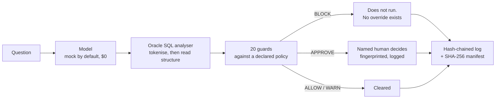

<h1 align="center">Cybwaysql</h1>

<p align="center"><b>An assurance harness for LLM-generated Oracle SQL.</b><br>
A model turns a question into a query. Cybwaysql decides — statically, before anything runs — whether
that query may execute at all: read-only enforcement, table and column allowlisting, sensitive-column
blocking, cost ceilings, bind-variable checking, and a human approval gate. Every decision is logged to
a tamper-evident trail, and the accuracy is measured against a published golden set.</p>

<p align="center">


</p>

<p align="center"><i>A personal AI-engineering portfolio project by V. Vikram — third in the Cybway family,
after <a href="https://github.com/eagles777/cybwaydb">Cybwaydb</a> and Cybwaycard.</i></p>

---

## The problem

Text-to-SQL is the most useful thing an LLM can do with a database and the most dangerous. The model is
good enough that people stop reading the query, and the failures are quiet: a `SELECT *` that returns a
column of identifiers nobody meant to expose, a missing join that turns two tables into a cartesian
product on a ninety-six-million-row table, a value from the user's own question concatenated into the
predicate instead of bound.

None of those are model failures you can prompt your way out of. They are the ordinary output of a good
model on an ordinary day, and they need a control that sits between generation and execution.

## What it does



Nothing in this project executes SQL. There is no database driver in it. "Dry run" means parse and
estimate, not run.

## What the guards check

| Area | Guards |
|---|---|
| Shape | Parses at all · one statement, not stacked · read-only enforced · no PL/SQL block · no `FOR UPDATE` |
| Objects | Every object known to the schema · table allowlist · no database links · no `DBMS_`/`UTL_` package calls · unrecognised functions flagged |
| Columns | No `SELECT *` · no columns above the policy's sensitivity ceiling · unqualified columns refused when they could resolve to a sensitive one |
| Cost | Estimated rows within ceiling · large tables carry a predicate · row limit where it is needed · cartesian products and join count |
| Craft | Values bound, not concatenated · no optimizer hints · subquery depth |
| Input | Prompt-injection patterns in the question itself |

Two gates sit alongside them: result size above a threshold, and any restricted column, ask for a named
person rather than refusing.

## The numbers

Measured against a golden set of 32 questions — 12 answerable, 10 correctly-written-but-not-permitted,
10 hostile — that ships in the repo and that a reader can disagree with. Evidence is committed under
[`docs/evidence/`](docs/evidence/) with its hash chain intact.

| | Reference SQL | End to end, faulty model |
|---|---|---|
| Verdict accuracy | **100%** | 75% |
| False blocks (good work refused) | **0%** | 62% |
| Missed blocks (bad work allowed) | **0%** | **0%** |
| Precision / recall on the block decision | 1.000 / 1.000 | 1.000 / 1.000 |

The second column is the interesting one. It is the same golden set with a model injected with faults at
a 35% rate, and the harness gets more conservative rather than more permissive.

**It fails closed.** As generation quality degrades from perfect to broken, missed blocks stay at zero:

| Model fault rate | 0.00 | 0.25 | 0.50 | 0.75 | 1.00 |
|---|---|---|---|---|---|
| Verdict accuracy | 1.000 | 0.844 | 0.750 | 0.656 | 0.688 |
| False block rate | 0.000 | 0.308 | 0.615 | 0.846 | 0.769 |
| **Missed block rate** | **0.000** | **0.000** | **0.000** | **0.000** | **0.000** |

Reproduce it with `cybwaysql bench --curve`.

## Quick start

```bash
pip install -e ".[dev]"
pytest                                    # 84 tests, offline, $0

cybwaysql ask "How many cases were opened in each office last quarter?"
cybwaysql check --sql "SELECT f.tax_id FROM filer f" --question "every tax id"
cybwaysql bench --curve                   # the golden set and the degradation curve
cybwaysql explain GUARD-011               # what one guard checks, and why
cybwaysql schema --sensitive              # the labelled columns
cybwaysql policy --out my-policy.json     # export, edit, then --policy-file
cybwaysql batch --file questions.txt --out runs/today --fail-on-block
cybwaysql verify --run-dir runs/today     # chain and manifest intact?
```

## The policy is data

A policy is a JSON document, so it is reviewed in a pull request by people who do not read Python:

```json
{
  "name": "read-only-analyst",
  "read_only": true,
  "max_sensitivity": "RESTRICTED",
  "denied_columns": ["FILER.TAX_ID", "FILER.EMAIL", "EXAMINER.EXAMINER_NAME", "..."],
  "max_estimated_rows": 5000000,
  "require_bind_variables": true,
  "approval_required_above_rows": 2000000
}
```

Two ship: `read-only-analyst` (a person querying a reporting replica) and `strict-public` (the floor).

## The approval gate

A query that needs a person waits for one. The approval carries a SHA-256 fingerprint over the question,
the SQL and the policy together — edit any of the three and the approval no longer applies. An approval
with no named approver is refused, and a rejection without a reason is refused too.

**A blocked query cannot be approved by anyone.** There is no override flag, no force option, no
environment variable. If a block is wrong, the policy is wrong, and a policy changes in a reviewed
commit.

## Honest limits

- **The analyser is not an Oracle parser.** It is a tokeniser plus a structural pass. It does not resolve
  views to base tables, evaluate expressions, or know what a query means. Where it is unsure it says so,
  and unsure means blocked.
- **The cost estimate is arithmetic on declared statistics.** It is not an execution plan and must never
  be shown as one. Every message carrying a number also carries the reasoning behind it.
- **ALLOW means "no guard fired against the policy you supplied."** It does not mean the query is safe,
  and the word "safe" appears in no verdict — there is a test that enforces that.
- **The numbers are measured against a golden set the author wrote.** Thirty-two cases a person has read
  and can defend. They say nothing about queries outside that set.
- **Everything is synthetic.** The schema, the row data, the questions and the queries are invented. No
  real database, credential, or organizational data appears anywhere.

## Safety and scope

Defensive only. The red-team cases exercise this project's own guards with published injection patterns,
the way promptfoo or DeepEval does. There is nothing here that teaches anyone to attack a database.

Mock provider by default: no key, no network, no cost. A live provider exists behind three locks — an
explicit opt-in flag, an environment key, and a budget charged *before* the call rather than counted
after — and ships with no network transport at all.

See [`LEGAL.md`](LEGAL.md) for source material and trademarks.

## License

Apache-2.0 — see [`LICENSE`](LICENSE) and [`NOTICE`](NOTICE). Copyright © V. Vikram.
